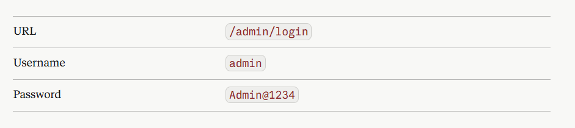

# Potato Corner Philippines Food Ordering System

A complete food ordering system for Potato Corner Philippines built with Python Flask, SQLite, and Bootstrap.

## Features

- 🍟 Browse Potato Corner menu with all flavors and sizes
- 🛒 Add items to cart with quantity management
- 💳 Checkout process with customer information
- 📦 Order tracking with real-time status updates
- 👑 Admin dashboard for order management
- 📱 Fully responsive design for mobile and desktop
- 🎨 Potato Corner themed UI with custom styling

## Technologies Used

- **Backend**: Python Flask
- **Database**: SQLite with SQLAlchemy ORM
- **Frontend**: HTML5, CSS3, JavaScript, Bootstrap 5
- **Additional**: jQuery, Font Awesome

## Installation

1. Clone the repository:
```bash
git clone https://github.com/yourusername/potato-corner-ordering.git
cd potato-corner-ordering


